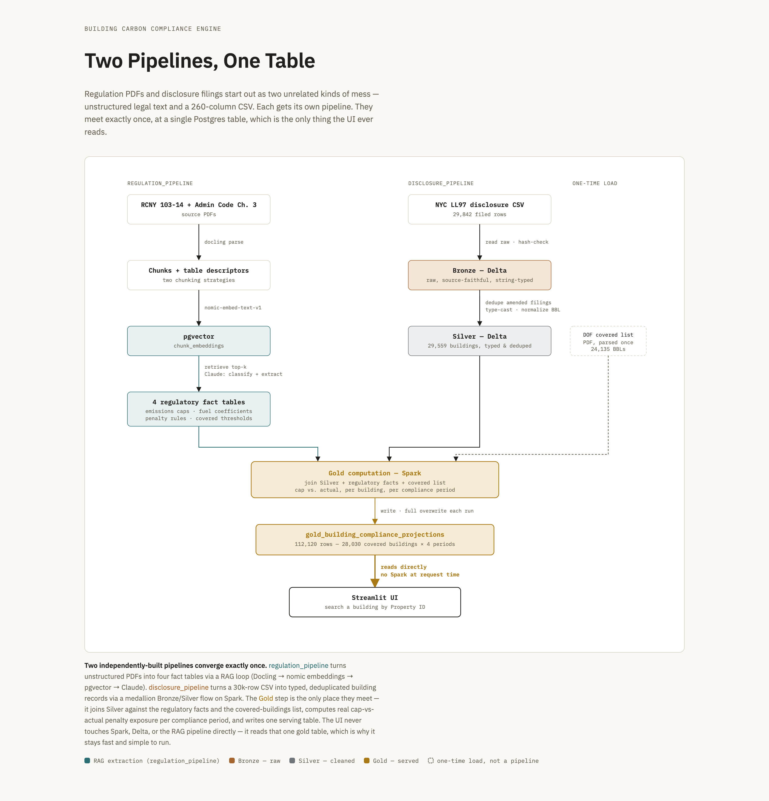

# CRE Carbon Compliance & Penalty Forecaster

Dual-pipeline architecture transforming NYC regulatory PDFs and building GHG disclosures into compliance projections and penalty forecasts.

## Background

- Global municipalities are passing strict **decarbonization laws and greenhouse gas reduction mandates** to combat climate change across commercial real estate portfolios.

- Building enforcement agencies, such as the NYC Department of Buildings (DOB), are implementing aggressive **carbon emission targets** 
and imposing steep **annual fines** on non-compliant properties.

- Property owners and asset managers face a growing operational burden to track evolving local rules, calculate true legal carbon footprints, and plan **capital expenditures** to avoid financial exposure.

## Problem Statement

- **Regulatory Fragmentation**: Cities and municipalities globally are mandating distinct carbon reduction targets, reporting frameworks, and penalty structures, making multi-jurisdictional portfolio compliance complex.
- **Non-Standardized Disclosures**: Each governing body requires different reporting formats, forcing property owners to manually reconcile disparate utility metrics against localized compliance caps.
- **Financial Risk & Valuation Exposure**: Carbon penalties directly hit Net Operating Income (NOI). CRE brokers, asset managers, and property managers must accurately incorporate future compliance fines into capital expenditure plans and property valuations.
- **Data & Tooling Gap**: Asset managers lack an automated engine to bridge unstructured regulatory legal codes with raw property disclosure data, leaving them blind to upcoming penalty exposures and retrofit ROI.

## Solution
- **Automated Regulatory Ingestion**: Automatically ingests and interprets complex legal PDF codes to extract carbon limits, fuel emission factors, and penalty calculation rules without manual human review.

- **Property Data Standardization**: Ingests, cleans, and standardizes raw utility disclosure filings across thousands of commercial properties, handling mismatched identifiers and duplicate filings.

- **Statutory Compliance Engine**: Computes exact carbon footprints and cap excesses using legally mandated municipal factors rather than generic federal estimates.

- **Multi-Period Penalty Forecasting**: Projects building-by-building financial liability and penalty exposure across current and future compliance windows (e.g., 2024–2029, 2030–2034).

- **Asset Manager Dashboard**: Provides real-time, searchable access for CRE brokers, asset managers, and property owners to look up specific properties, view compliance status, and evaluate cap-vs-actual carbon performance.


## Technical Architecture & Tech Stack
* **End-to-End Modular Stack**: Built with Python, Apache Spark, Delta Lake, PostgreSQL (`pgvector`), Anthropic Claude, Docling, and Streamlit.

* **Dual-Pipeline Execution Engine**:
  * **`regulation_pipeline`**: Standardizes unstructured PDFs into structured rules via Docling parsing, `nomic-embed-v1` embeddings, vector storage in `pgvector`, and Claude-driven schema extraction into 4 regulatory fact tables.
  
  * **`disclosure_pipeline`**: Ingests, cleans, type-casts, and deduplicates the 260-column municipal CSV using a Spark-powered Medallion Architecture (Bronze -> Silver).
  
* **Unified Analytical Compute (Gold Layer)**: Joins Silver property records against extracted regulatory facts and the covered-buildings list in PySpark, writing final multi-period compliance and penalty projections directly to a single PostgreSQL serving table (`gold_building_compliance_projections`).

* **Decoupled Serving Layer**: Streamlit UI queries the single Gold table directly, bypassing high-latency Spark compute and heavy LLM extraction loops at request time.




## Current Scope & Initial Validation

- **Multi-City Pilot**: Currently deployed and benchmarked using municipal disclosure datasets and statutory codes from **New York City** and **Boston**:
  * **NYC Local Law 97 (LL97)**: Evaluated against NYC Department of Buildings (DOB) regulations covering 50,000+ buildings ($268/ton penalty over cap).
  * **Boston BERDO (Building Emissions Reduction & Disclosure Ordinance)**: Configured for Boston Air Pollution Control Commission standards covering commercial properties $\ge$20,000 sq. ft. ($300–$1,000/day non-compliance fines).
- **Extensible Framework**: Designed with modular schemas so additional municipal regulations can be onboarded via standard rule-extraction prompts without altering the core analytical engine.

---

## Getting started

### Prerequisites

**1. Java 21** (required for `disclosure_pipeline` — PySpark + Delta
Lake). Check this first — a too-new default JDK breaks Spark's bundled
Hadoop code:
```
/usr/libexec/java_home -V
```
If no `21.x` entry is listed:
```
brew install --cask temurin@21
export JAVA_HOME=/Library/Java/JavaVirtualMachines/temurin-21.jdk/Contents/Home
```

**2. Postgres with pgvector**, running locally, reachable at the URL in
`.env`. `pgvector` needs to be available at the server level (bundled
with Postgres.app, or `brew install pgvector` for a Homebrew Postgres):
```
createdb cra_dev
```

**3. Python 3.11+**
```
python3 -m venv .venv
.venv/bin/python -m pip install -e ".[dev]"
```

**4. Environment variables** — copy `.env.example` to `.env` and fill in
`DATABASE_URL` and `ANTHROPIC_API_KEY`.

### Setup

```
for f in db/migrations/*.sql; do psql "$DATABASE_URL" -f "$f"; done
.venv/bin/pytest
```

### Clean end-to-end run

```
# 1. Reset
psql "$DATABASE_URL" -c "DROP SCHEMA public CASCADE; CREATE SCHEMA public;"
for f in db/migrations/*.sql; do psql "$DATABASE_URL" -f "$f"; done
rm -rf data/lake

# 2. regulation_pipeline (both PDFs — fuel_coefficients draws from both)
.venv/bin/python scripts/run_regulation_pipeline.py

# 3. Covered buildings list (one-time, not a pipeline)
.venv/bin/python scripts/load_covered_buildings_list.py

# 4. disclosure_pipeline: Bronze -> Silver -> Gold
.venv/bin/python scripts/run_disclosure_pipeline.py
```
Step 2 makes real, billed Anthropic API calls and can take several
minutes; step 4 processes the full ~30k-row disclosure CSV through Spark.

### Run the UI

```
.venv/bin/streamlit run streamlit_app.py
```

## Project layout

- `regulation_pipeline/` — regulation PDF → structured facts (chunking,
  embedding, extraction, persistence; orchestrated end-to-end by `pipeline.py`)
- `disclosure_pipeline/` — building disclosure filings → compliance/penalty
  projections (`bronze.py` / `silver.py` / `gold.py`)
- `streamlit_app.py` — the building-search UI
- `db/migrations/` — Postgres DDL, applied in numeric order
- `regulation_pipeline/db/queries.sql` — every SQL statement `regulation_pipeline`
  uses (see `CLAUDE.md` for the convention)
- `config/schema/extraction_fields.json` — the field vocabulary driving
  `regulation_pipeline`'s LLM extraction
- `scripts/` — one-off/orchestration scripts (full pipeline runs, the
  covered-buildings one-time load)
- `data/raw_pdfs/`, `data/disclosures/` — source documents
- `docs/ai-transcripts/` — development session transcripts
- `docs/examples/` — hand-worked compliance examples used as ground truth
  for the automated calculation
